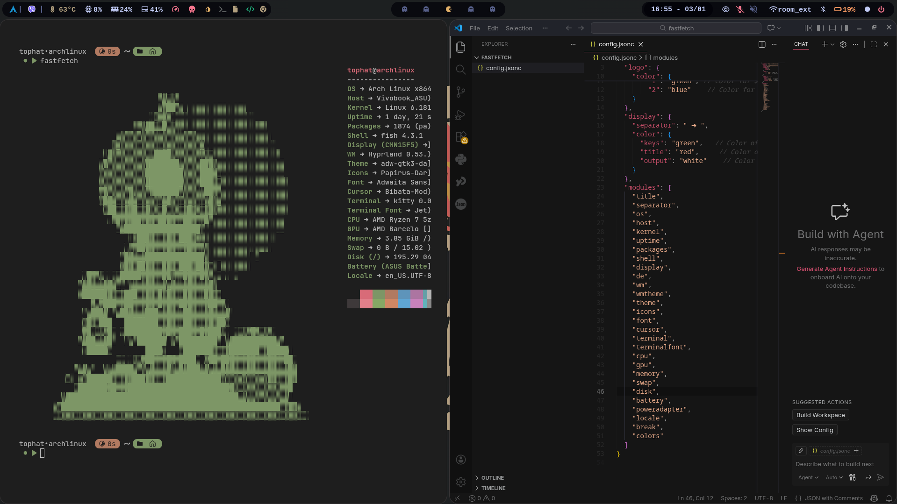

# Hyprland Arch Linux Config

My personal Hyprland configuration.

## Software
- WM: Hyprland
- OS: Arch Linux

## Notes
- google-chrome-stable has been set on startup , to get rid of this , remove or comment the line exec-once = google-chrome-stable.

- config files are from end-4 and have been modified. https://github.com/end-4/dots-hyprland   

- waybar needs a custom script to switch between power modes.

- rofi bar original is from https://github.com/adi1090x/rofi/tree/master.

## Screenshots

